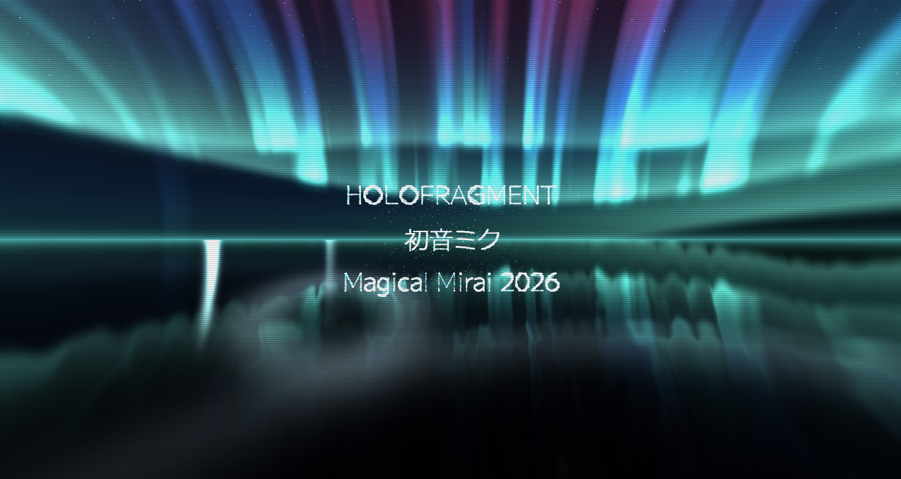
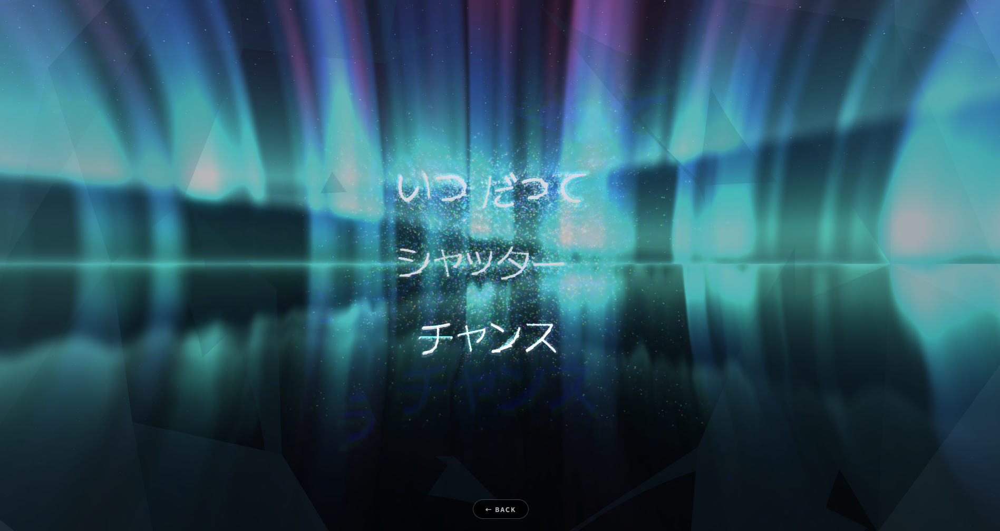
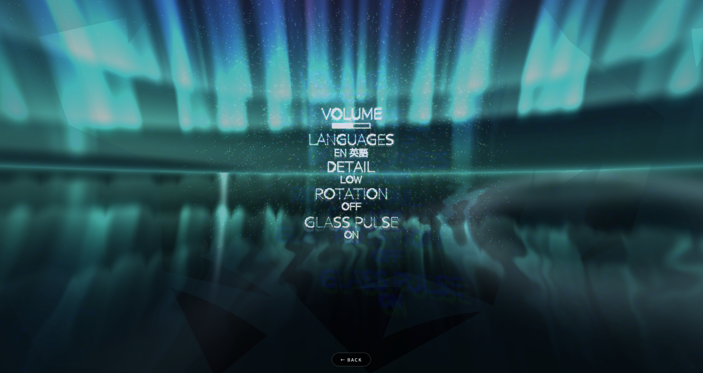
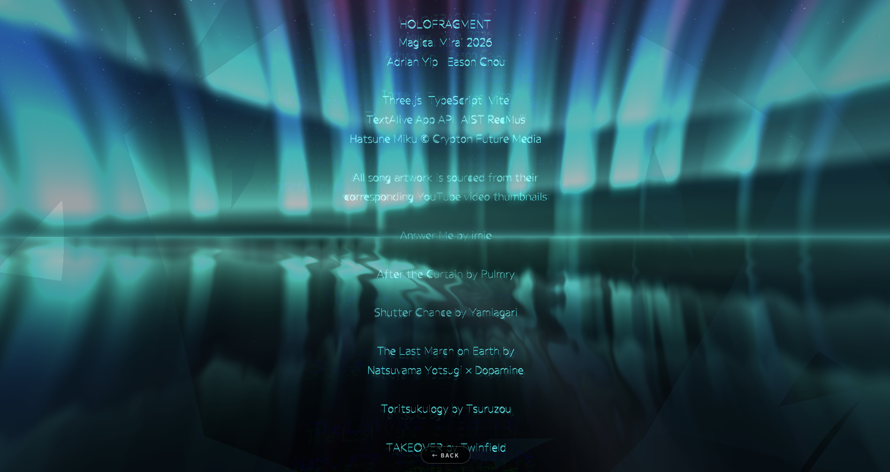

# HOLOFRAGMENT : 初音ミク Magical Mirai 2026



## About

### HOLOFRAGMENT - Hatsune Miku is a projection of light, and so are the words she sings.

A voice only lasts as long as it's sung, and for that moment, it's hers alone. On stage, Miku is a hologram, a singer made of pure light. HOLOFRAGMENT treats her words the same way. 

Each song opens as a galaxy of tens of thousands of light particles drifting through space. The moment Miku sings, the particles answer her, rushing together, holding the shape of her words for as long as her voice holds them, then dissolving until the next line. 

The particles are shaped by each performance, so no two moments ever repeat. Please enjoy this small, private concert of light that rebuilds her words in front of you.


### HOLOFRAGMENT — 初音ミクは光の投影。そして彼女が歌う言葉もまた、光でできている。

歌声は、歌われているあいだだけ存在する。そしてその一瞬だけ、それは彼女だけのもの。ステージで、ミクはホログラム、純粋な光でできた歌姫です。HOLOFRAGMENT は、その言葉を同じものとして描きます。

どの曲も、数万の光の粒子が空間を漂う銀河として始まります。ミクが歌い出した瞬間、粒子が応える。一気に集まり、彼女の声が支えているあいだだけ言葉のかたちを保ち、そして次の一行が来るまで、溶けていきます。

粒子はその一度きりの演奏によって形づくられ、同じ瞬間は二度と訪れません。彼女の言葉を目の前で組み上げ直す、光でできた、あなただけのささやかなコンサートを、どうぞお楽しみください。

---

**[Try the app here!](https://magical-mirai-2026-inky.vercel.app)**<br>
**[Demo video (Shutter Chance)](https://youtu.be/rRq49zvPCic)**

<details>
<summary><strong> Images </strong></summary>

### Main Menu


### Playing a Song


### Settings


### Credits


</details>

## How to Use

1. Go to settings and adjust them to your liking (Volume, Language, and Shader configurations for the glass)

2. Use your cursor or swipe (on mobile) to navigate to a song.

When a song is hovered on in the main menu, a loading animation will play and the song's preview will start, indicating that it is ready to play (where you would click into the song).
If you click into a song before the loading animation completes, you may need to wait until the song fully loads before it begins.

### Note

HOLOFRAGMENT runs on both desktop and mobile, and automatically tunes its visual detail to your device so it stays smooth everywhere. For the fullest version of the effects, we recommend a desktop or a recent phone.


## Installation

1. Clone the repo

```sh
$ git clone https://github.com/AdrianYip1/magical-mirai-2026
```

2. Install dependencies

```sh
$ npm ci
```

3. Create a `.env` file in the project root with your [TextAlive](https://developer.textalive.jp/) application token

```sh
VITE_TEXTALIVE_TOKEN=<YOUR_TOKEN>
```

4. Start the dev server (which allows for hot reloading)

```sh
$ npm run dev
```

## Architecture

Please see [ARCHITECTURE.md](docs/ARCHITECTURE.md) for a breakdown and guide of the tech stack and project structure.

## Credits

HOLOFRAGMENT was made for the Magical Mirai 2026 Programming Contest by **Adrian Yip** and **Eason Chou**.

Hatsune Miku © Crypton Future Media, INC.

### The music

None of this works without the songs, so thank you to the artists and their music:

- **Answer Me（こたえて）** by **imie** ([piapro](https://piapro.jp/t/6W2N/20251215164617))
- **After the Curtain（アフター・ザ・カーテン）** by **Rulmry** ([piapro](https://piapro.jp/t/zoqO/20251214200738))
- **Shutter Chance（シャッターチャンス）** by **Yamiagari（夜未アガリ）** ([piapro](https://piapro.jp/t/PNpQ/20251209170719))
- **The Last March on Earth（世界最後の音楽隊）** by **Natsuyama Yotsugi × Dopamine（夏山よつぎ × ど〜ぱみん）** ([piapro](https://piapro.jp/t/B3yJ/20251215061727))
- **Toritsukulogy（トリツクロジー）** by **Tsuruzou（鶴三）** ([piapro](https://piapro.jp/t/QBdL/20251215094303))
- **TAKEOVER** by **Twinfield** ([piapro](https://piapro.jp/t/E2i3/20251215092113))

Each song's card art is taken from their respective YouTube video thumbnail.

### Built with

The lyric timing and playback come from the [TextAlive App API](https://developer.textalive.jp/) provided by AIST RecMus (産業技術総合研究所 メディアインタラクション研究グループ). Everything you see on screen is rendered with [Three.js](https://threejs.org/) and written in [TypeScript](https://www.typescriptlang.org/), and the whole thing is bundled with [Vite](https://vite.dev/). 
The aurora background and the reflective sphere are drawn with custom [GLSL](https://www.khronos.org/opengl/wiki/Core_Language_(GLSL)) shaders.
